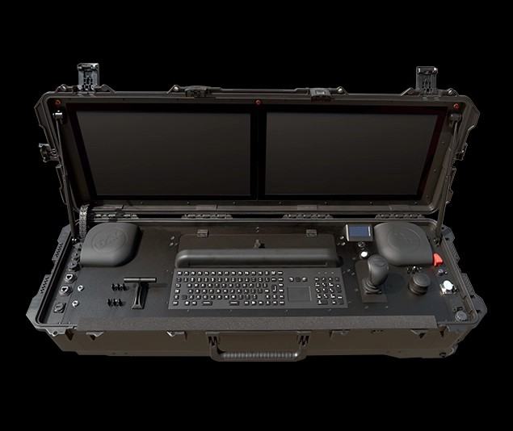
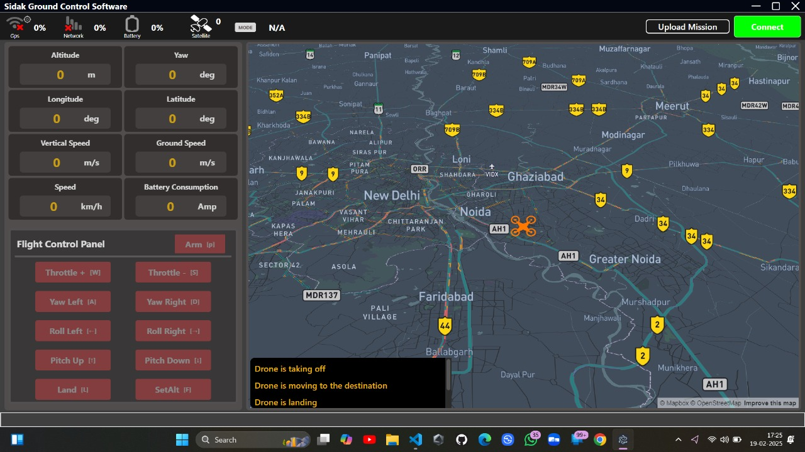
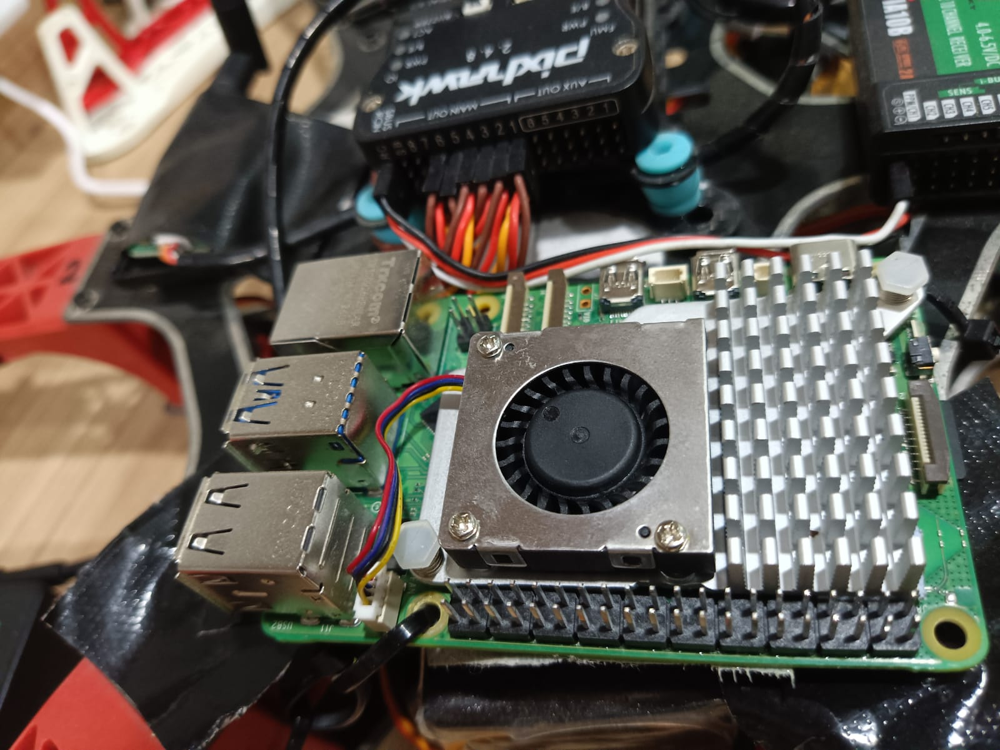

<!DOCTYPE html>
<html lang="en">
<head>
    <meta charset="UTF-8">
    <meta name="viewport" content="width=device-width, initial-scale=1.0">
    <title>SkyOps Project Structure</title>
</head>
<body>
    <h1>SkyOps Project Structure</h1>
    <pre>
skyops/
│
├── src/
│   ├── main.py
│   ├── core/
│   │   ├── utils/
│   │   ├── config/
│   │
│   ├── communication/
│   │   ├── mavlink/
│   │   │   ├── handler.py
│   │
│   ├── mission/
│   │   ├── waypoints/
│   │   │   ├── __init__.py
│   │   │   ├── planner.py
│   │   ├── simulation/
│   │       ├── __init__.py
│   │       ├── sitl.py
│   │
│   ├── telemetry/
│   │   ├── __init__.py
│   │   ├── logging/
│   │   │   ├── __init__.py
│   │   │   ├── telemetry_logger.py
│   │   ├── processing/
│   │       ├── __init__.py
│   │       ├── analyzer.py
│   │
│   ├── ui/
│   │   ├── __init__.py
│   │   ├── components/
│   │   │   ├── map_renderer.py
│   │   ├── controllers/
│   │       ├── dashboard.py
│   │
│   ├── security/
│   │   ├── auth.py
│   │   ├── encryption.py
│   │
│   ├── plugins/
│   │   ├── __init__.py
│   │
│   ├── tests/
│       ├── test_core.py
│       ├── test_mavlink.py
│
├── docs/
│   ├── README.md
│
├── logs/
│   ├── .gitkeep
│
├── data/
│   ├── .gitkeep
│
├── requirements.txt
├── README.md
└── LICENSE
    </pre>

    <h2>High-Level System Architecture</h2>
    
The SkyOps system architecture follows a modular design for seamless UAV control and telemetry processing.

    <ul>
        <li><strong>Ground Control Station (GCS)</strong>: User interface for mission planning, telemetry visualization, and control.</li>
        <li><strong>Raspberry Pi Backend</strong>: Handles communication between the GCS and the UAV, relaying telemetry and control commands.</li>
        <li><strong>Pixhawk Flight Controller</strong>: Executes commands received from the Raspberry Pi running ArduPilot.</li>
        <li><strong>Live Video Feed</strong>: Real-time video streaming from the UAV camera to the GCS.</li>
    </ul>

    <h2>System Communication Flow</h2>
    
The communication flow is as follows:

    <ul>
        <li>The GCS sends mission commands to the Raspberry Pi.</li>
        <li>The Raspberry Pi processes these commands and communicates with the Pixhawk flight controller via MAVLink.</li>
        <li>Telemetry data is sent back from Pixhawk to the Raspberry Pi and then relayed to the GCS.</li>
        <li>The UAV camera streams live video to the GCS for real-time monitoring.</li>
    </ul>

    <h2>Hardware Components</h2>
    <h3>Physical GCS</h3>
    

    <h3>GCS interface</h3>
    
    
    <h3>Raspberry Pi Communication Module</h3>
    
    
    <h3>UAV with Pixhawk Flight Controller</h3>
    
</body>
</html>
